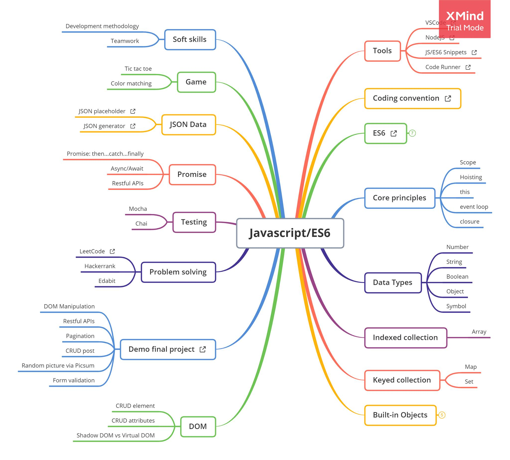

# JS01 - Javascript Introduction

## Giới thiệu tổng quát khóa học JS (24 buổi chia làm 8 tuần). Mình học những gì? Làm được những gì sau khi học?



- Quy tắc đặt tên hàm, biến chuẩn [Coding conversion](https://github.com/airbnb/javascript)

- ECMAScript (ES): đặc tả của ngôn ngữ JS (JS follow theo đặc tả ES). Được update hằng năm từ 2015.

- Luyện Problem Solving để luyện tập tư duy Logic trên [LeetCode](https://leetcode.com/problemset/all/?difficulty=Easy)

- Viết Unit testing để kiểm thử code đúng hay sai. 

- DOM (Document Object Model) để tương tác với HTML.

- NodeJS là runtime của JS. Giúp code JS có thể chạy ở bất kỳ đâu có NodeJS. Thay vì chỉ chạy được trên trình duyệt như trước đây, giờ đây JS có thể chạy được ở phía Back-end và cả Database.

- Output khóa học 

    + [Game Tic-Tac-Toe](https://paulnguyen-mn.github.io/js-tic-tac-toe/)
    + [Game Color Matching](https://color-matching-game.vercel.app/)
    + [Final Project - CRUD Blog Posts](https://paulnguyen-mn.github.io/posts-ui/)

[Đọc thêm chi tiết tại EZFrontend](https://www.ezfrontend.com/docs/tong-quan-ve-javascript)


### Function

- Function có vai trò làm một nhiệm vụ cụ thể nào đó. Một function chỉ nên làm 1 nhiệm vụ và làm thật tốt nhiệm vụ đó (tối ưu là dưới 30 dòng cho 1 function).

- Code JS chỉ là một tập hợp những function để thực thi những nhiệm vụ cụ thể. 

- 1 function chỉ nên có tối đa 3 params

- Đặt tên cho function bắt đầu bằng động từ như 'is...', 'has...' (do function để thực thi một nhiệm vụ nào đó)

### Variables

- Đặt tên biến bắt đầu bằng danh từ. Ví dụ:

```
const name = 'Edward';
const firstName = 'Thuan';
```

[Demo code](main.js)
